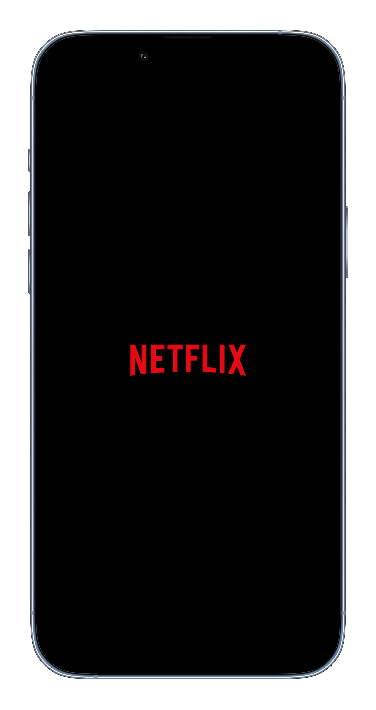
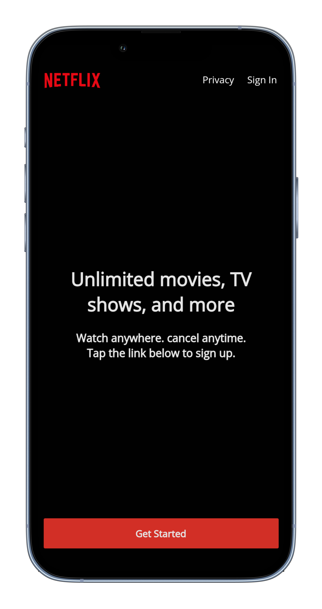
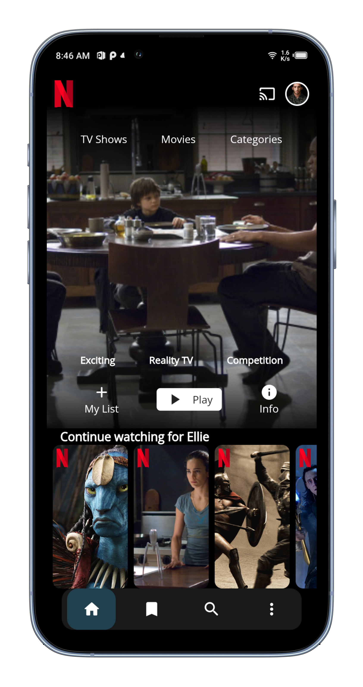
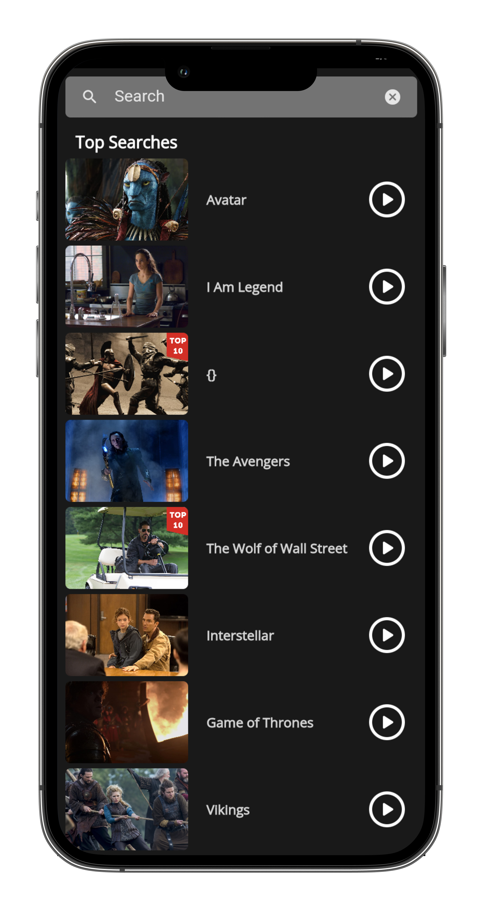

# Netflix UI Clone using Flutter

This project is a replica of the Netflix user interface, developed using Flutter. It aims to showcase my skills in mobile app development with Flutter and my ability to recreate complex user interfaces.

## Features

- **Home Screen**: Mimics the Netflix home screen layout, displaying trending movies and TV shows.
- **Category Browsing**: Allows users to browse movies and TV shows by categories, similar to the Netflix app.
- **Search Functionality**: Implements a search feature for users to search for specific movies or TV shows.
- **Custom Widgets**: Utilizes custom widgets and animations to replicate the look and feel of the Netflix app.

## Technologies Used

- **Flutter**: Cross-platform framework for building mobile applications.
- **Dart**: Programming language used for Flutter app development.

 
  
  
  
  

  

 
  
  

